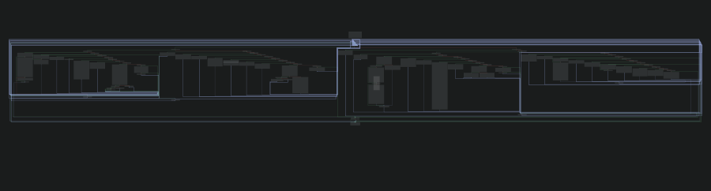
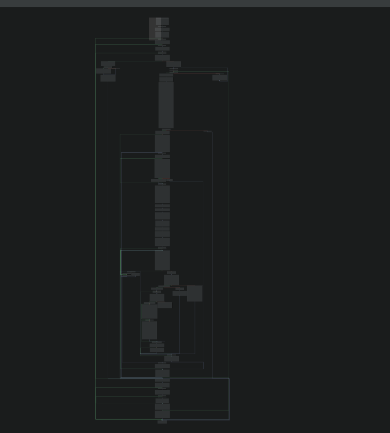
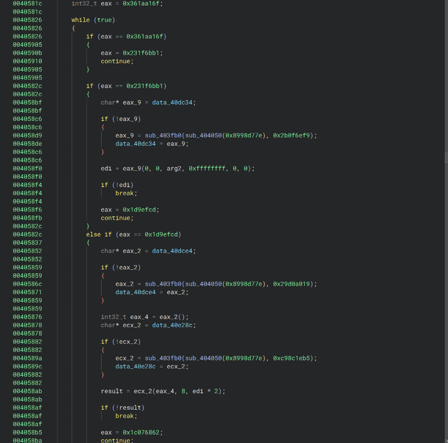
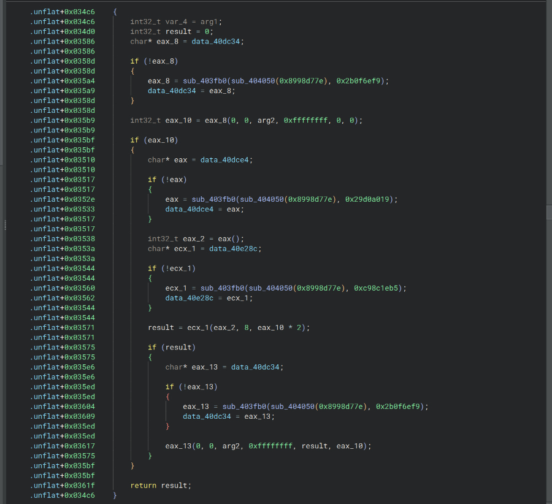

# Emotet Control‑Flow Unflattener
A Python tool that recovers the original control flow of Emotet malware that has been obfuscated through control flow flattening, leveraging symbolic execution through Angr.


## Notes
- Supports both 32‑bit and 64‑bit Windows PE binaries
- Tested against real Emotet binaries first submitted to VirusTotal in 2024
- Deobfuscation may take significant time (up to ~1 hour per binary), depending on sample complexity

## Prerequisites

- Python 3.10 or higher

## Installation
1. Clone the repository:

```bash
git clone https://github.com/Kzhong-sec/Emotet-unflattener.git
cd Emotet-unflattener
```

2. Install Python dependencies:

```bash
pip install -r requirements.txt
```

## Usage

This tool is executed via the `unflatten.py` entry point.  
All required Python files must reside in the same directory.

### Arguments
```bash
python unflatten.py --binary <path> [--function <addr>] [--output <path>]
```


- `--binary`, `-b`  
  **Required.** Path to the target Windows PE binary.

- `--function`, `-f`  
  Optional function address to unflatten (hex or decimal).  
  If omitted, all functions are processed.

- `--output`, `-o`  
  Optional output binary path.  
  Defaults to `<input>.unflattened`.


## Output
See the results of the tool below.

**Figure 1: Basic blocks before deobfuscation**  


**Figure 2: Basic blocks after deobfuscation**  


**Figure 3: Decompilation before deobfuscation**  


**Figure 4: Decompilation after deobfuscation**  
